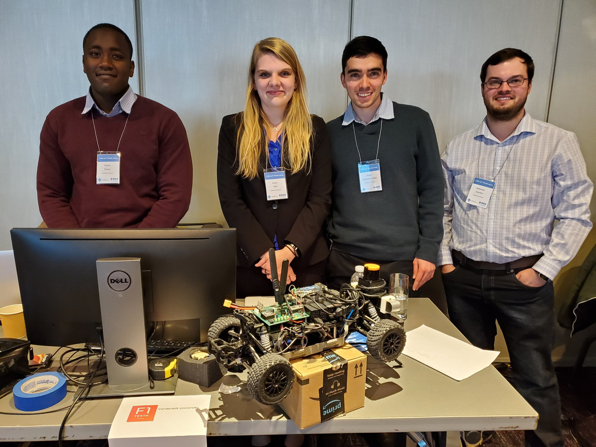
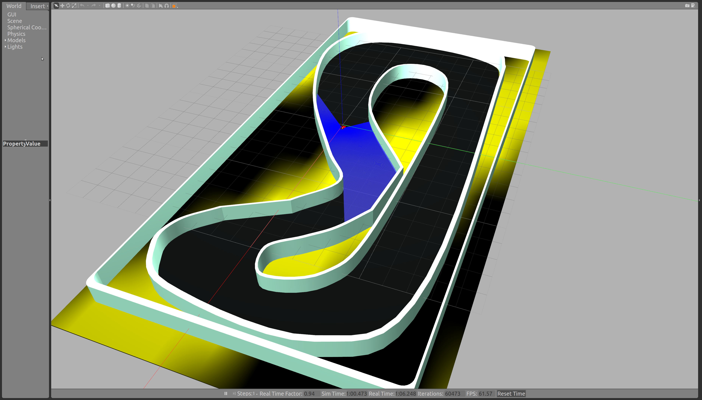
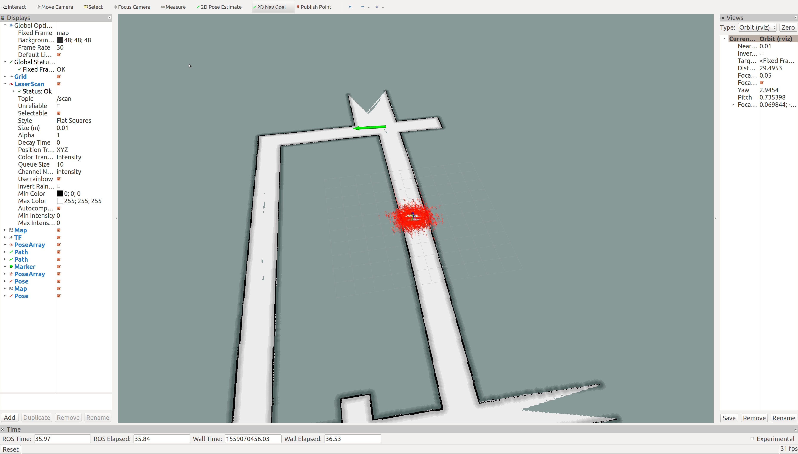

# The FLASH Van 
The team name stands for **F**u**l**ly **A**utonomous but **S**tuff **H**appens and we are from **Van**derbilt.
Team members are:
* [Patrick Musau](https://www.linkedin.com/in/musaup/) (Project Leader)
* [Diego Manzanas Lopez](https://www.linkedin.com/in/diego-manzanas-3b4841106/)
* [Nathaniel (Nate) Hamilton](https://www.linkedin.com/in/nathaniel-hamilton-b01942112/)
* [Feiyang Cai](https://www.linkedin.com/in/feiyang-cai-8b845a124/)
* [Tim Darrah](https://www.linkedin.com/in/timothydarrah/)
* [Shreyas Ramakrishna](https://www.linkedin.com/in/shreyasramakrishna/)
* [Ayana Wild](https://www.linkedin.com/in/ayana-wild/)



# Vehicle Configuration
Our car is modeled after the V2 using a Hokuyo UST-10LX lidar and ZED Camera for sensing and localization, with a NVIDIA TX2 for processing. For information about our build configuration, kindly refer to the following [pdf](https://github.com/verivital/F1TenthVanderbilt/blob/master/BuildV2.pdf).

# Repository Organization
**racecar-ws**: Code deployed on the physical car. 

**f110-fall2018-skeletons**: F1Tenth Simulation Code

**hector_slam**: ROS hector_slam package. Used to learn a map of the environment and simultaneosuly esimate the platforms 2D pose at laser scanner frame rate.

**particle_filter**: A fast particle filter localization algorithm developped by Corey Walsh et al.

**range_libc**: Raycasting library utilized the particle filter package

**a_stars_pure_pursuit**: ROS package for a pure pursuit motion planner developped by sidsingh@seas.upenn.edu

**Note that when installing the simulator, do not include the racecar-ws directory in your ROS workspace.** This code is meant to be deployed on the car and will cause name conflicts if included in the simulation package.


# Algorithms
A good summary of the algorithms needed to implement an autonomous racecar using localization and planning can be found on pages 46-73 of the [BuildV2 manual](https://github.com/verivital/F1TenthVanderbilt/blob/master/BuildV2.pdf).

We implemented two racing strategies in simulation that I will briefly summarize below.  
1. The first strategy made use of the [teb local planner](http://wiki.ros.org/teb_local_planner) ROS pacakge for path planning, Adaptive Montecarlo Localization [(AMCL)](http://wiki.ros.org/amcl) for probabilistic localization, and [gmapping](http://wiki.ros.org/gmapping) for laser-based SLAM (Simultaneous Localization and Mapping). The challenge here was generating goal points that resulted in smooth driving. Additionally one thing we will try in the future is to use the MIT particle filter for localization instead of amcl.
2. The second strategy used the a_stars_pure_pursuit pacakge for path planning, MIT particle filter for localiztion, and [gmapping](http://wiki.ros.org/gmapping) for laser-based SLAM (Simultaneous Localization and Mapping). This was by far our most successful strategy in terms of speed and smoothness of driving. However unfortunately we were not able to translate these results onto the physical car in time for the competition. To run the simulation follow the instructions below.

# F1Tenth Simulation
The simulation packages in this repository contain code to run a car autonomously on a race track/circuit. The simulator was  originally developed by the [mLAB: Real-Time and Embedded Systems Lab](https://github.com/mlab-upenn/f110-fall2018-skeletons) at the University of Pennsylvania and we have customized it for our own experiments. The simulator was built using [ROS](http://wiki.ros.org/) and [Gazebo](http://gazebosim.org/tutorials). There are several race tracks available for testing and they are contained in racecar_gazebo/worlds directory. However, the majority of our testing utilized the following .world files:
  1. track_barca.world
  2. track_porto.world
  3. track_levine.world

##### You will need to install the following ROS packages to get the simulator to work

#### Local Install
Assuming you have ROS and Gazebo installed run: 

```bash
$ sudo apt-get install ros-kinetic-ros-control ros-kinetic-ros-controllers ros-kinetic-gazebo-ros-control ros-kinetic-ackermann-msgs ros-kinetic-joy
```
To install the naviagation packages run the following: 

```bash 
$ sudo apt-get install ros-kinetic-teb-local-planner ros-kinetic-move-base ros-kinetic-navigation
```
 
To launch the simulation run the following roslaunch command:
```roslaunch race f1tenth.launch```

This will start Gazebo, [RViz](http://wiki.ros.org/rviz) and ROS. At a high level, Gazebo is a robust physics engine, with convenient programmatic and graphical interfaces for robot simulation. RViz is a 3D visualizer for sensor data, robot models, environment maps, which is useful for developing and debugging code. Once you run the above command, a window will pop up showing the racecar in a virtual track equipped with a camera, lidar, an imu, and odometry estimation obtained from the [VESC](https://www.electric-skateboard.builders/t/new-vesc-user-read-this-complete-walktrough-of-the-vesc/2980). 




#### Important ROS Nodes
- [/keyboard_node](https://github.com/verivital/F1TenthVanderbilt/blob/master/f110-fall2018-skeletons/simulator/f1_10_sim/race/scripts/keyboard.py): allows you to drive the car using the keys w-a-s-d
- [/sim_connector_node](https://github.com/verivital/F1TenthVanderbilt/blob/master/f110-fall2018-skeletons/simulator/f1_10_sim/race/scripts/sim_connector.py): translates keyboard commands into control inputs for the car. These commands are then published on the topic ```/vesc/ackermann_cmd_mux/input/teleop```
- [/message_to_tf](https://github.com/verivital/F1TenthVanderbilt/blob/master/f110-fall2018-skeletons/simulator/f1_10_sim/race/scripts/message_to_tf.py): creates an odometric frame for the car so that the transformation tree in ROS is completer
- [/map_server](http://wiki.ros.org/map_server#map_saver): loads and saves occupancy grids obtained from SLAM algorithms

#### Important ROS Topics
- ROS messages from the camera are broadcasted on the ```/camera/zed/rgb/*``` topics, 
- Lidar data is broadcasted on the ```/scan``` topic.
- Odometry data is broadcasted on the ```/vesc/odom``` topic
- IMU (Inertial Measurement Unit) data is broadcasted on the ```/imu``` topic
-  The topic ```/vesc/ackermann_cmd_mux/input/teleop```  is of type ackermann_msgs/AckermannDriveStamped. Publishing an AckermannDrive Stamped message on this topic will casue the car to move

#### Changing the track
To change the track utilized in the simulation change value parameter at the top of [f1_tenth.launch](https://github.com/verivital/F1TenthVanderbilt/blob/master/f110-fall2018-skeletons/simulator/f1_10_sim/race/launch/f1_tenth.launch) ```<arg name="world_name" value="track_porto"/>``` to one of the names listed in the racecar_gazebo/worlds directory as mentioned above.


#### Strategy 1: Hallway simulation using teb planner, amcl, map built from gmapping:
```roslaunch wall_following move_base.launch```

Once you have run the above command. Navigate to rviz and set to navigation goals by clicking on the toolbar at the top of the screen in order to make the car move. 


#### Strategy 2: Pure Pursuit and Particle Filter Localization
Run the simulation:
```roslaunch race f1_tenth.launch```

This script simply launches the car in the racetrack, enables keyboard teleoperation, and launches the relevant sensors

Run the particle filter:
```roslaunch particle_filter localize.launch```

**Note**: It takes the particle filter a couple of seconds to receive an initial position from Gazebo before the node begins publishing. 

Run pure pursuit
```roslaunch a_stars_pure_pursuit pure_pursuit_sim.launch  ```

##### Collecting waypoints

If you wish to collect waypoints so that you can run pure pursuit on a new track run the following ```rosrun a_stars_pure_pursuit waypoint_logger_pure_pursuit.py```

This will run a rosnode that collects positional information of the car and store them in the waypoints directory of the **a_stars_pure_pursuit** package. Drive the car manually using the keyboard node in order to collect the points. Once you have collected a sufficient number of waypoints run ```roslaunch a_stars_pure_pursuit pure_pursuit_sim.launch```


# Multi-Car Experiments

Multicar-experiments are now available via simulation. At the present time it is limited to only two cars. To launch the simulation simply run:

``roslaunch race multi_car_general.launch``

This will launch both cars in gazebo and drive them using a gap following algorithm. The gap finding algorithm can be found in the race package and is called ``disparity_extender_vanderbilt.py``. It was inspired by the following blog post by Nathan Otterness [blog](https://www.nathanotterness.com/2019/04/the-disparity-extender-algorithm-and.html).

It will also launch a keyboard node that allows you to control the second car. If you wish to tele-operate the first car simply run ``rosrun race keyboard.py``

The following gif displays a sample of the experiment: 


# Docker

Install [NVIDIA-Docker](https://github.com/NVIDIA/nvidia-docker) to containerize and run GPU accelerated workloads. In order to run the simulation please install it. 

Additionally we make use of [Docker-Compose](https://docs.docker.com/compose/install/)  to define and run the simulation. Kindly install this as well. 

To build the docker image
```docker build -t ros_test .```

Test if the image builds correctly by running: ```docker container run --rm --runtime=nvidia -it -e DISPLAY  --env="QT_X11_NO_MITSHM=1" -v /tmp/.X11-unix:/tmp/.X11-unix -d ros_test```

In order to  enable the use of graphical user interfaces within Docker containers such as Gazebo and Rviz run the following command: 

```xhost +local:root``` 

 This command allows one to connect a container to a host's X server for display **but it is not secure.** It compromises the access control to X server on your host. So with a little effort, someone could display something on your screen, capture user input, in addition to making it easier to exploit other vulnerabilities that might exist in X.
 
**So When you are done run :** ```xhost -local:root ``` to return the access controls that were disabled with the previous command.


To run the pure-pursuit simulation:

```docker-compose up```

To run the teb planner simulation: 

```docker-compose -f docker-compose2.yml up```

To teleoperate the car:

```docker container exec -it keyboard bash ```

Then run: ```source devel/setup.bash && rosrun race keyboard.py ```


